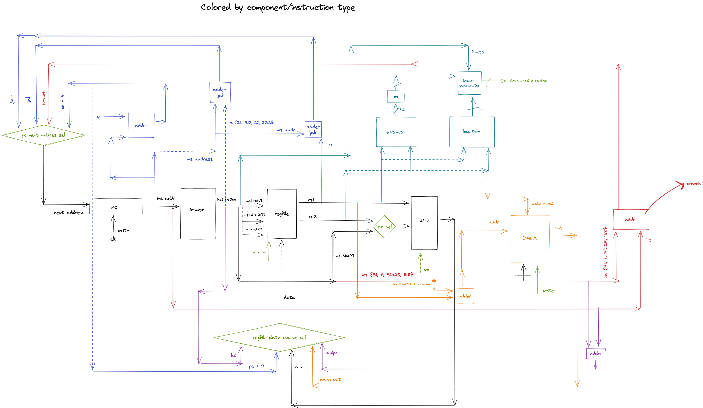

# A RISC-V implementation that runs a kernel with a TCP/IP Stack (a.k.a. a computer from the ground-up)

The schematic has some missing pieces (such as data memory) because I mostly used it as a way to think how things would fit, so don't take it as a serious design document.

In order to test the design, you have to input the instructions into the `initial` block inside `insmem.v`. The assembler in `utils/assembler.py` can be used to generate the code necessary to setup the tests - it translates assembly into binary and breaks it up into bytes that get assigned to their respective places inside `insmem.v`. 

I wrote this as a learning exercise while watching lectures and reading on computer architecture. As I watched some CS61C lectures from UC Berkeley I found online, I decided that instead of writing a RISC-V core in Logisim (as it gets asked in one of the class projects) I would write it in an actual HDL that would let me later extend it and perhaps synthesize it on an FPGA - at least that's the objective right now.

I also want to write some software to make it useful - as the title of this README suggests - but I need to figure out how to implement some hardware (networking, graphics etc.).

## Parts

* Hardware implementation in Verilog
	* Single-cycle (for now) RISC-V (RV32I) core
	* 16k bytes of data memory
	* TODO: some networking hardware? (no clue for now)
* Software
	* TODO: Minimal kernel written in some language idk with a TCP/IP stack
* Other stuff that needs tinkering with both hardware and software:
	* TODO: Graphics

